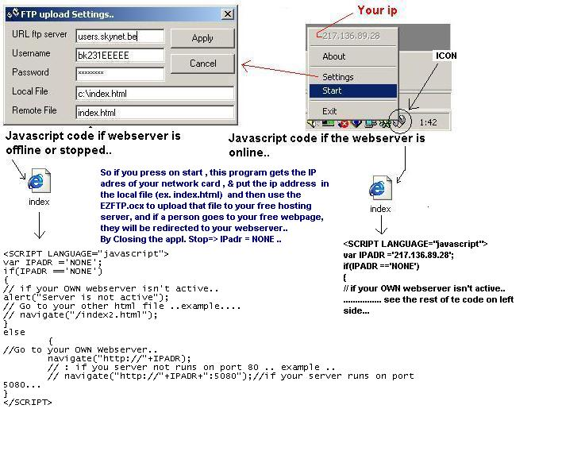



## Dynamic WebServer UPDATED \!\!

### Description

UPDATED !!! bugs released , now with Errorhandling ..This application let it make a dynamic Webserver..

'If you have a free account by provider ex. A , and you got some free webspace...

'but the provider wouldn't let you use the full advantage of free ASP.. PHP...

'and you have a PWS , IIS ,....

'You can now make your own webserver ..

'How it works..

'

----

'you start this program .. then you can see a ico .. right down..,

'this application detects the ip adres..& then it change some data in the index.html..

'local on your computer on drive.. x (change it by settings..)

'& then it would be uploaded to your free web- provider..

'Next step is, i have written some very- easy code in index.html (javascrpit) hat reads the

'ip adres & the script detects if your webserver is online.. if its true ,

'the user navigates to your free account & the person will be directed to your webserver.

'(standard port 80)... but you can change it in the javascript..'

'AND now you GOT THE FULL POWER... to do anythings...

Please VOTE for me..

Remark : I use a freeware OCX called EZFTP.OCX,

you can download it on my site (under construction)

http://users.skynet.be/verburgh.peter

PS : Read the ReadMe_Web.txt included in the ZIP file.

Thx for the responses & helping hands !!
 
### More Info
 
'REMARK : its possible , that it wouldn't work if you have multiple IP , have installed on

'your pc... because WINSOCK.OCX use the default..

'you can handle it by binding...

PS : I'm using a free OCX for uploadind the file to the free server.. called EZFTP.OCX

             |
---                |---
**Submitted On**   |2001-06-29 23:36:02
**By**             |[Peter V\.](https://github.com/Planet-Source-Code/PSCIndex/blob/master/ByAuthor/peter-v.md)
**Level**          |Intermediate
**User Rating**    |4.9 (39 globes from 8 users)
**Compatibility**  |VB 4\.0 \(32\-bit\), VB 5\.0, VB 6\.0
**Category**       |[Complete Applications](https://github.com/Planet-Source-Code/PSCIndex/blob/master/ByCategory/complete-applications__1-27.md)
**World**          |[Visual Basic](https://github.com/Planet-Source-Code/PSCIndex/blob/master/ByWorld/visual-basic.md)
**Archive File**   |[Dynamic We219266292001\.zip](https://github.com/Planet-Source-Code/peter-v-dynamic-webserver-updated__1-24513/archive/master.zip)

